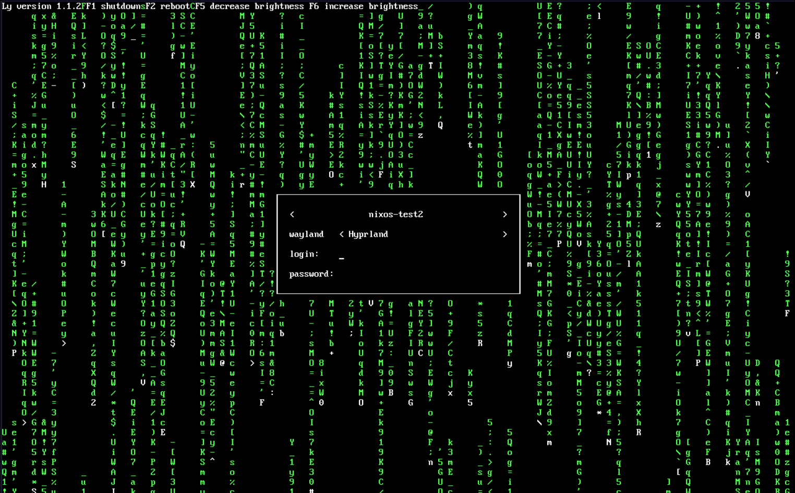
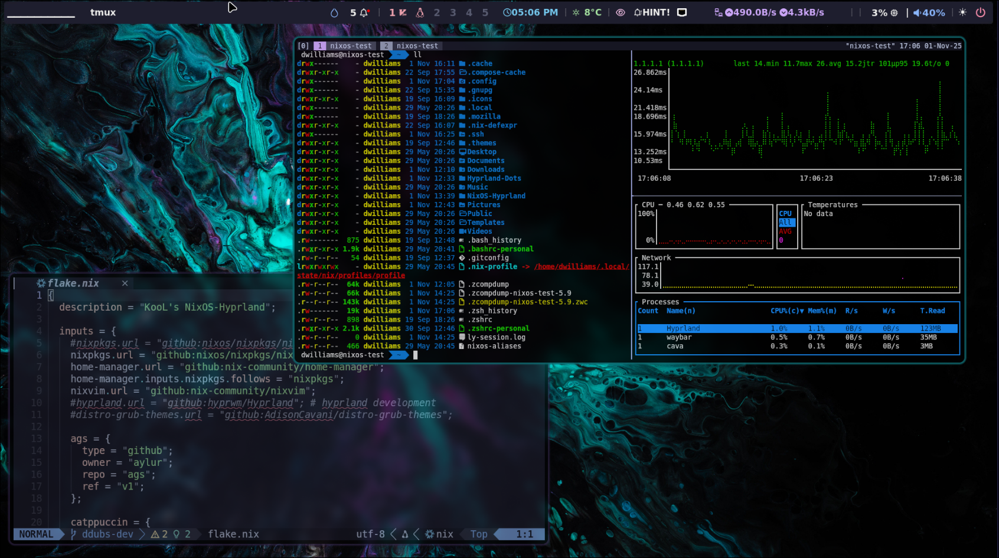

<!-- ================================================== -->
<!--  KoolDots (2026) -->
<!--  Project URL: https://github.com/LinuxBeginnings -->
<!--  License: GNU GPLv3 -->
<!--  SPDX-License-Identifier: GPL-3.0-or-later -->
<!-- ================================================== -->
<div align="center">

# 💌 ** KooL ❄️ NixOS-Hyprland Install Script ** 💌

<p align="center">
  
</p>

   <a href="https://discord.gg/RZJgC7KAKm">  </a>

<br/>
</div>

<div align="center">
<br> 
  <a href="#announcement"><kbd> <br> Read this First <br> </kbd></a>&ensp;&ensp;
  <a href="#autoinstall"><kbd> <br> Auto Install <br> </kbd></a>&ensp;&ensp;
  <a href="#manualinstall"><kbd> <br> Manual Install <br> </kbd></a>&ensp;&ensp;
  <a href="#revertconfigs"><kbd> <br> Reverting to your previous config <br> </kbd></a>&ensp;&ensp;
 </div><br>

<p align="center">
  
</p>

<div align="center">
👇 KOOL's Hyprland-Dots related Links 👇
<br/>
</div>
<div align="center">
<br>
  <a href="https://github.com/LinuxBeginnings/Hyprland-Dots/tree/NixOS-Dots"><kbd> <br> KooL Hyprland-Dots NixOS repo <br> </kbd></a>&ensp;&ensp;
  <a href="https://www.youtube.com/playlist?list=PLDtGd5Fw5_GjXCznR0BzCJJDIQSZJRbxx"><kbd> <br> Youtube <br> </kbd></a>&ensp;&ensp;
  <a href="https://github.com/LinuxBeginnings/Hyprland-Dots/wiki"><kbd> <br> Wiki <br> </kbd></a>&ensp;&ensp;
  <a href="https://github.com/LinuxBeginnings/Hyprland-Dots/wiki/Keybinds"><kbd> <br> Keybinds <br> </kbd></a>&ensp;&ensp;
  <a href="https://github.com/LinuxBeginnings/Hyprland-Dots/wiki/FAQ"><kbd> <br> FAQ <br> </kbd></a>&ensp;&ensp;
  <a href="https://discord.gg/kool-tech-world"><kbd> <br> Discord <br> </kbd></a>
</div><br>

<p align="center">
  
</p>

<h3 align="center">
	
	KooL Hyprland-Dotfiles Showcase 
	
</h3>

<br>

<p align="center">
	
	
	
</p>

<br>

<div align="center">

https://github.com/user-attachments/assets/49bc12b2-abaf-45de-a21c-67aacd9bb872

</div>

> [!CAUTION]
> This is not purely written in Nix-Language. You should check ZaneyOS. Link below

> [!IMPORTANT]
> The install scripts assumes a clean installation of NixOS or the understanding that it will replace any existing configuration
> It will not merge into an existing NixOS configuration.

> [!WARNING] Use this code at your on your own risk!

> Currently, this project is on the unstable nixpkgs channel.

> [!NOTE]

- Being on the unstable channel is a bigger challenge to maintain.
- An NIX package update, can prevent a rebuild, or require updating nix settings.

- Make sure to read Hyprland's [WIKI](https://wiki.hyprland.org/Nix/Hyprland-on-NixOS/)

<summary><strong> 🪧🪧🪧 Important announcement 🪧🪧🪧 </strong></summary>  
<br>    
<div id="announcement"></div>

- ** This Repo does not contain Hyprland configuration files. (Dotfiles)! **
    - You can either, use `KoolDots`, create your own configuration, or try to use another project's config.
    - Make sure you have all the requirements first. I.e. fonts, supporting packages, at the correct version

- This new release adds Home Manger, but only manages a small set of packages
    - bat
    - bottom
    - btop
    - eza
    - fzf
    - ghostty
    - git
    - micro editor (theme and syntax highligts)
    - nano editor (theme and syntax highligts)
    - NeoVim (via NIXVIM)
    - tealdir
    - yazi

> [!NOTE]
> ** Not all of the configuration files in this project are written in NIX language **

- The `auto-install.sh` script will install the Hyprland config files, (Dotfiles) from [`KooLDots`](https://github.com/LinuxBeginnings/Hyprland-Dots)
- These Hyprland dotfiles are constantly evolving / improving
- You can check the CHANGELOG here [`Hyprland-Dots-Changelogs`](https://github.com/LinuxBeginnings/Hyprland-Dots/wiki/Changelogs)
- GTK Themes and Icons will be pulled from [`LINK`](https://github.com/LinuxBeginnings/GTK-themes-icons), including Bibata Cursor Modern Ice
- You will be prompted if you want to download wallpapers from here: [`REPO`](https://github.com/LinuxBeginnings/Wallpaper-Bank)

> [!NOTE]
> The wallpapers contain AI generated and AI enhanced images. If this is an issue for you enter "N" when prompted to download them

<br>

> [!IMPORTANT]
> Take note of the requirements

<details>
<summary><strong>👋 👋 👋 Requirements </strong></summary>

> [!WARNING] The flake will update system to current unstable branch

- You must be running on NixOS 25.11+
- 26.05+ recommended
- BARE minimum space required is 64GB. 128GB+ is recommended as NixOS is a space-hungry distro
- Must have installed NIXOS using **GPT partition ** & Boot **UEFI**
- `/boot` must be at least 1GB. (Some are now recommending 2GB b/c of firmware size increases)
- Systemd-boot is configured as the default bootloader

</details>
<details>
<summary><strong> 🖥️ Multi Host & User Configuration </strong></summary>

- You can now define separate settings for different host machines and users!
- Easily specify extra packages for your users in the users.nix file.
- Easy to understand file structure and simple, but encompassing, configuration.

</details>
<details>
<summary><strong> 📦 How To Install Packages? </strong></summary>

- You can search the [Nix Packages](https://search.nixos.org/packages?)
- [Options](https://search.nixos.org/options?) pages for what a package may be named or if it has options available that take care of configuration hurdles you may face.
- By default, all the packages are in `$HOME/NixOS-Hyprland`
- Then edit `hosts/<your-hostname>/configs.nix` , `hosts/<your-hostname>/packages-fonts.nix` and/or `hosts/<your-hostname>/user.nix` depending on what you want.
- The `config.nix` file is for system packages with options. ie `programs.hyprland.enable=true`
- `$HOME/NixOS-Hyprland/modules/packages.nix` are where you add programs for all hosts globally.
- The packages-fonts.nix file is for adding packagesa or fonts, for that specific host. Changes made to `user.nix` are only available to the current user.
- Once you are finished editing, run:

```
sudo nixos-rebuild switch --flake ~/NixOS-Hyprland/#<hostName>
```

</details>

<details>
<summary><strong>🙋 Having Issues / Questions? </strong></summary>
    
- Please feel free to raise an issue on the repo, please label a feature request with the title beginning with [feature request], thank you!
- If you have a question about KooL's Hyprland dots, see [`KooL's Dots WIKI`](https://github.com/LinuxBeginnings/Hyprland-Dots/wiki). Contained within the wiki is an FAQ, along with other pages for tips, keybinds, and more!
</details>

## ⬇️ Installation

#### 📽 Youtube video for using this script

- [KooL's Hyprland Dots on NixOS](https://youtu.be/nJLnRgnLPWI)

<details>
<summary>📜 1. Using auto install Script:</summary>
<br>
<div id="autoinstall"></div>
    
- This is the easiest and recommended way of starting out. 
- This script is NOT meant to allow you to change every option that you can in the flake.
- It won't help you install extra packages.
- It is simply here so you can get my configuration installed with as little chance of breakages.
- It is up to you to fiddle with to your heart's content!
- Simply copy this and run it:
```
nix-shell -p git vim curl pciutils
sh <(curl -L https://github.com/LinuxBeginnings/NixOS-Hyprland/raw/refs/heads/main/auto-install.sh)
```

> [!NOTE]
> pciutils is necessary to detect if you have an Nvidia card.
 
</div>

</details>

<details>
<summary>🦽 2. Manual: </summary>
<br>
<div id="manualinstall"></div>

- Run this command to ensure git, curl, vim & pciutils are installed: Note: or nano if you prefer nano for editing

```
nix-shell -p git vim curl pciutils
```

- Clone this repo & CD into it:

```
git clone --depth 1 https://github.com/LinuxBeginnings/NixOS-Hyprland.git ~/NixOS-Hyprland
cd ~/NixOS-Hyprland
```

- _You should stay in this directory for the rest of the install_
- Create the host directory for your machine(s)

```
cp -r hosts/default hosts/<your-desired-hostname>
```

- Edit as required the `config.nix` , `packages-fonts.nix` and/or `users.nix` in `hosts/<your-desired-hostname>/`
- then generate your hardware.nix with:

```
sudo nixos-generate-config --show-hardware-config > hosts/<your-desired-hostname>/hardware.nix
```

- Run this to enable flakes and install the flake replacing hostname with whatever you put as the hostname:

```
NIX_CONFIG="experimental-features = nix-command flakes"
sudo nixos-rebuild switch --flake .#hostname
```

Once done, you can install the GTK Themes and Hyprland-Dots. Links are above

</details>

<details>
<summary>👉🏻 3. Alternative </summary>
    
- auto install by running `./install.sh` after cloning and CD into NixOS-Hyprland
> [!NOTE]
> install.sh is a stripped version of auto-install.sh as it will not re-download repo

- Run this command to ensure git, curl, vim & pciutils are installed: Note: or nano if you prefer nano for editing

```
nix-shell -p git curl pciutils
```

- Clone this repo into your home directory & CD into it:

```
git clone --depth 1 https://github.com/LinuxBeginnings/NixOS-Hyprland.git ~/NixOS-Hyprland
cd ~/NixOS-Hyprland
```

</details>

> [!IMPORTANT]
> need to download in your home directory as some part of the installer are going back again to ~/NixOS-Hyprland

- _You should stay in this directory for the rest of the install_
- edit `hosts/default/config.nix` to your liking. Once you are satisfied, ran `./install.sh`
  Now when you want to rebuild the configuration, you have access to an alias called `flake-rebuild` that will rebuild the flake!

</details>

Hope you enjoy! 🎉

<details>
<summary><strong>💔 known issues 💔 </strong></summary>
- GTK themes, icons, and the cursor, are not applied automatically. gsettings does not seem to work.
- You can set GTK themes, icons, and the cursor, using nwg-look
</details>

🪤 My NixOS configs

- on this repo [`KooL's NIXOS Configs`](https://github.com/LinuxBeginnings/NixOS-configs)

🎞️ AGS Overview DEMO

- in case you wonder, here is a short demo of AGS overview [Youtube LINK](https://youtu.be/zY5SLNPBJTs)

⌨ Keybinds

- Keybinds [`CLICK`](https://github.com/LinuxBeginnings/Hyprland-Dots/wiki/Keybinds)
- Tmux Cheatsheet [`English`](assets/tmux.cheatsheet.md) | [`Español`](assets/tmux.cheatsheet.es.md)
- Intro to Neovim [`English`](assets/Intro-to-Neovim.md) | [`Español`](assets/Intro-to-Neovim.es.md)

> [!TIP]
> KooL's Dots v2.3.7 has a searchable keybind function via rofi. (SUPER SHIFT K) or right click the `HINTS` waybar button

<details>
<summary><strong>⌚ Setting timezone </strong></summary>
<br>    
    
- By default, your timezone is configured automatically using the internet. 
- To set your timezone manually, edit `host/<your-hostname>/config.nix`
 
</details>

#### 🫥 Improving performance for Older Nvidia Cards using driver 470

- [`SEE HERE`](https://github.com/LinuxBeginnings/Hyprland-Dots/discussions/123#discussion-6035205)

<details>
<summary><strong>🔙 Reverting back to your default configs </strong></summary>
<br>
<div id="revertconfigs"></div>
    
- If you use flakes, you can just simply locate your default or previous configs. CD into it and execute `sudo nixos-rebuild switch --flake .#<your-previous-flake-hostname>`
- If you didn't have flakes enabled previously, simply running `sudo nixos-rebuild switch` will revert you to your default configs contained in `/etc/nixos/` 
- ⚠️ just remember to clean up your nix/store to remove unnessary garbage from your system `sudo nix-collect-garbage -d`
- OR, simply just revert into a previous generation of your system by choosing which generation to boot via your bootloader.
</details>

#### 📒 Final Notes

- join my discord channel [`Discord`](https://discord.gg/RZJgC7KAKm)
- Feel free to copy, re-distribute, and use this script however you want. Would appreciate if you give me some loves by crediting my work :)

<details>
<summary><strong>✍️ Contributing </strong></summary>
    
- As stated above, these script does not contain actual config files. These are only the installer of packages
- If you want to contribute and/or test the Hyprland-Dotfiles (development branch), [`Hyprland-Dots-Development`](https://github.com/LinuxBeginnings/Hyprland-Dots/tree/development)
- Want to contribute on KooL-Hyprland-Dots Click [`HERE`](https://github.com/LinuxBeginnings/Hyprland-Dots/blob/main/CONTRIBUTING.md) for a guide how to contribute
- Want to contribute on This Installer? Click [`HERE`](https://github.com/LinuxBeginnings/NixOS-Hyprland/blob/main/CONTRIBUTING.md) for a guide how to contribute
</details>

👍👍👍 Thanks and Credits!

- [`Hyprland`](https://hyprland.org/) Of course to Hyprland and @vaxerski for this awesome Dynamic Tiling Manager.
- [`ZaneyOS`](https://gitlab.com/Zaney/zaneyos) - template including auto installation script and idea. ZaneyOS is a NixOS-Hyprland with home-manager. Written in pure nix language

<details>
<summary><strong>💖 Support </strong></summary>

- a Star on my Github repos would be nice 🌟

- Subscribe to my Youtube Channel [YouTube](https://www.youtube.com/@LinuxBeginnings)

</details>
<details>
<summary><strong> 📹 Youtube videos (Click to view and watch the playlist) 📹 </strong></summary>
[](https://youtube.com/playlist?list=PLDtGd5Fw5_GjXCznR0BzCJJDIQSZJRbxx&si=iaNjLulFdsZ6AV-t)
</details>

🥰🥰 💖💖 👍👍👍
[](https://starchart.cc/LinuxBeginnings/NixOS-Hyprland)
